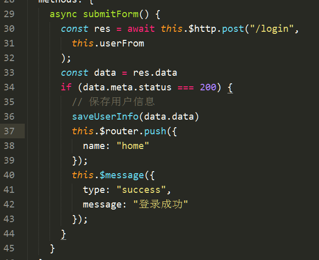

title: 从零开始搭建vue项目 请求拦截器 响应拦截器
date: 2018-06-24 20:40:50
tags:
---

### 1.安装vue cli，基于webpack模版

基于webpack模版初始化一个名称为admin的项目
vue init webpack admin-vue
```javascript
npm install -g vue-cli
vue init webpack my-project
cd my-project
npm install
npm run dev
```


```
.
├── build webpack	打包相关的配置文件目录
├── config webpack	打包相关的配置文件目录
├── node_modules	第三方依赖包 千万不要动它
├── src	项目源码
│   ├── assets	存储资源，例如 css、 img、 fonts
│   ├── common	存储一些公共的业务组件
│   ├── components	存储所有组件
│   ├── router	路由
        └──  index.js	路由配置文件
│   ├── App.vue  单页面应用程序的根组件
│   └── main.js  开机键，负责把根组件替换到根节点
├── static  可以放一些静态资源
│   └── .gitkeep
├── .babelrc  es6转es5配置文件，给 babel 编译器用的
├── .editorconfig 
├── .eslintignore  eslint配置文件
├── .eslintrc.js  eslint配置文件
├── .gitignore  git忽略上传文件
├── index.html  单页面引用程序的单页
├── package.json 项目依赖项等信息
├── package-lock.json
├── .postcssrc.js  postcss类似于 less、sass 预处理器
└── README.md
```

### 2.导入ElementUI

http://element.eleme.io/#/zh-CN/component/installation

```
安装 依赖 npm install element-ui
复制表单源码
安装axios   npm i axios
```

### 3.封装axios扩展为vue插件

axios文档地址： https://github.com/axios/axios
vue文档地址： https://cn.vuejs.org/v2/guide/plugins.html#开发插件

```javascript
import axios from 'axios'
import { getToken } from '@/assets/js/auth'
const http = axios.create({
  baseURL: 'http://localhost:8888/api/private/v1'
})

// vue插件
// https://cn.vuejs.org/v2/guide/plugins.html#开发插件
const httpPlugin = {}
httpPlugin.install = function (Vue, options) {
  // 4. 添加实例方法
  Vue.prototype.$http = http
}
export default httpPlugin
// 5 在main.js加载
// vue.use(httpPlugin)

```
在全局组件中调用$http来发起请求
例如




### 请求拦截器 
```javascript
// https://github.com/axios/axios
// axios 配置请求拦截器
http.interceptors.request.use(function (config) {
  // Do something before request is sent
  if (config.url != '/login') {
    config.headers['Authorization'] = getToken()
  }
  return config;
}, function (error) {
  // Do something with request error
  return Promise.reject(error);
});


```
### 响应拦截器
```javascript
// axios 配置响应拦截器
// Add a response interceptor
axios.interceptors.response.use(function (response) {
  // Do something with response data
  const { meta } = response.data
  if (meta.status === 403) {
    window.alert('你没有权限执行该操作！')
  } else if (meta.status === 401) {
    // 401 token 失效 跳转到登录组件
    router.push({
      name: ' login',
      query: {
        redirect: window.location.hash
      }
    })
  }
  return response;
}, function (error) {
  // Do something with response error
  return Promise.reject(error);
});
```
